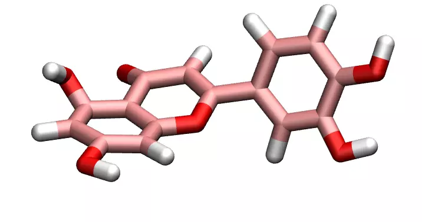

# ATB to LAMMPS file converter

Use Python and [Moltemplate](https://www.moltemplate.org/) to convert 
files from the [ATB repository](https://atb.uq.edu.au/) to LAMMPS format. 

Several examples are given here, including [luteolin](luteolin_C15H10O6/),
[methane](methane_CH4), or [ethanol](ethanol_C2H5OH). 

## How to add a new molecule

### Save the files from the ATB

Within *molecules/*, create a folder with the format *name_formula/*, 
where name is the molecule name, and formula its chemical formula.

Save the two *.lt* files from the atb within *molecules/*.

### Run atb2lammps

From the *atb2lammps/* folder, run *execute_atp2lammps.py* using Python.
