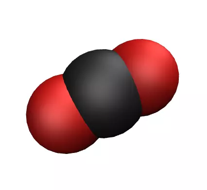

# atb2lammps



Use Python and Moltemplate to convert files from the ATB repository to LAMMPS format.

## Use

Simply run atb2lammps.sh using bash:

```
bash atb2lammps.sh KIR7_allatom_optimized_geometry.lt
```

Then run LAMMPS: 

```
lmp -in input.lammps
```

The dump file can be visualised using vmd:

```
vmd dump.lammpstrj
```


## Alternative use:

### Extract system.lt file

```
python3 extract_system_lt.py KIR7_allatom_optimized_geometry.lt
```

### Execute moltemplate

```
moltemplate.sh system.lt
```

### Create clean system

```
python3 clean_system.py
```

### Delete extra files

```
rm -r output_ttree
rm system.*
```

### run LAMMPS

```
lmp -in input.lammps
```
