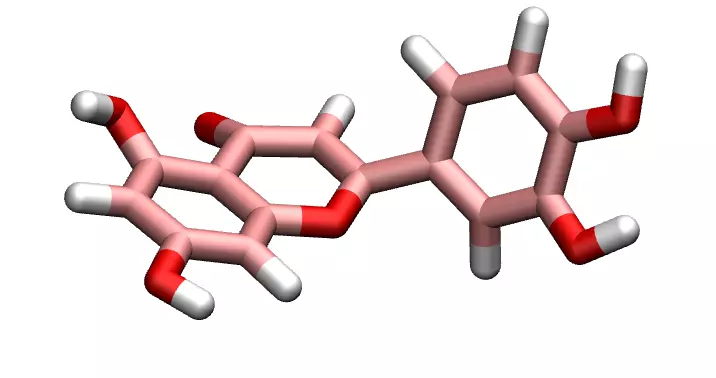

# ATB-to-LAMMPS file converter

Use Python and [Moltemplate](https://www.moltemplate.org/) to convert 
files from the [ATB repository](https://atb.uq.edu.au/) to LAMMPS format. 

For each molecule, a LAMMPS [data file](https://docs.lammps.org/read_data.html),
a LAMMPS [molecule file](https://docs.lammps.org/molecule.html),
and a LAMMPS parameter file are provided.
A minimal LAMMPS input file is also provided.

If you are not familiar with [LAMMPS](https://www.lammps.org/),
you can find tutorials [here](https://lammpstutorials.github.io/).

## Full molecule list

- [ethanol](molecules/ethanol_C2H5OH)
- [pentaethyleneglycol](molecules/pentaethyleneglycol_C10H22O6)
- [luteolin](molecules/luteolin_C15H10O6)
- [carbondioxide](molecules/carbondioxide_CO2)
- [toluene](molecules/toluene_C7H8)
- [propane](molecules/propane_C3H8)
- [peg](molecules/peg_C28H58O15)
- [water](molecules/water_H2O)
- [methane](molecules/methane_CH4)
- [acetronitrice](molecules/acetronitrice_C2H3N)
- [nitrogen](molecules/nitrogen_N2)
- [hexaethyleneglycol](molecules/hexaethyleneglycol_C12H26O7)
- [decane](molecules/decane_C10H22)
- [ethane](molecules/ethane_C2H6)

## How to add a new molecule

### Save the files from the ATB

Within *molecules/*, create a folder with the format *name_formula/*, 
where *name* is the molecule name, and *formula* its chemical formula
(something like C15H10O6).

Save the two *.lt* files from the atb within *molecules/*.

### Run atb2lammps

From the *atb2lammps/* folder, run *execute_atp2lammps.py* using Python.
